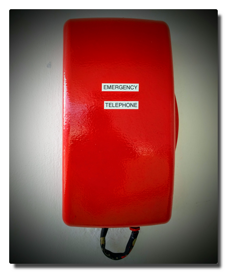

<!--
.. title: Love Boat - The Real Story. Haugesund
.. slug: norge03
.. date: 2019-03-15 18:32:32 UTC+01:00
.. tags: norway,cruise
.. category: outandabout
.. link: 
.. description: 
.. type: text
-->

# Day 3. God morgen, Haugesund!

We are on time landing in Haugesund which is our first and most southern stop. After having breakfaast we prepare for our shore excursion.

|  |
| --- |
| *Haugesund havn* |

Soon we are strolling through the small inner city and stopping by at the tourist information because we are experienced individual tourists and know our duties.
Haugesund's main attraction is within walking range so we visit the combined monument Haraldshaugen (with the Haraldstøtten obelisk) und Krosshaugen (that with the stone cross) in memory to the rule of king Harald Hårfagre (Harald Fairhair) and the country's christianity.

|  |
| --- |
| *Harald Hårfagre* |

My travel mates decide to take a rest after the walk and I decide to fight at the pie buffet again. I am triumphant and celebrate my victory with cake and tea.

|  |
| --- |
| *No human or other creature was harmed filling this plate.* |

We depart in the early evening and face another complete day at the ocean. Later on the winds intensify, at Beaufort force 7 both of our male travel party members call in seasick.

## The noise of the sea

Travelling by ship is done on purpose. Being on the way moving is part of the destination. It is proven that maritime surroundings do have positive health effects on humans. One can even buy recordings of maritime and water noises or just listen to these on YouTube.

That is interesting because for humans the ocean is a hostile ecosystem full of dangers and therefore a natural frontier. To us the sound of the rushing sea is fascinating and we are able to watch the movements of the water and the waves for eternity. Instead of calming us down it should make us freak out because without the safety area of the steely colossus we would be dead within minutes.

## Friendship

Last summer during a sailing trip on the river Havel I got into a heavy and fast moving thunderstorm with winds between 7 to 9 bft causing huge damages on land.
We were able to take our position in a bay to let the storm pass over us maneuvring with as little sail as possible. That worked pretty well, still that was a tough and shaky situation involving massive amounts of water from various directions.

Reminded of this event I watch the waves and try to think through the thought experiment we sometimes talk about at sunny days: if we piloted the boat in direction New York, how far would we get in that nutshell (Friendship 24 sailing boat)? When well prepared and equipped and a bit lucky regarding the weather one can get mildly optimistic but if you are knocked out or thrown overboard at 10 bft and 12 meter high waves your remains will not ever be found.

That brings me to another question:

## When do people realize somebody is missing?

I did not count how often I was advised not to pull a Küblböck in advance of the journey. In case you do not know (which is probably the case): Daniel Küblböck was a casting show/reality TV personality who had become a last sad media footnote by jumping off a cruiseship into the ocean in some previous year.

In this video by a travel journalist it is stated that up to 19 persons vanish from cruiseships every year.

<iframe width="560" height="315" src="https://www.youtube.com/embed/cs5UKha9ALc?start=324" frameborder="0" allow="accelerometer; autoplay; encrypted-media; gyroscope; picture-in-picture" allowfullscreen></iframe>

Jumping off a sailing ship into the ocean is a very, very safe method of committing suicide. Even if there are witnesses it is almost impossible to keep track of the lost person in the water if the person is conscious and gets back to the water surface at all until rescue measures are initiated.
Any person who ever has performed a "man/buoy over board" maneuvre will comprehend this.

**If one goes overboard without witnesses, it will not be noticed at first.**

|  |
| --- |
| *The Red Telephone* |

### Crew

Missing crew is probably noticed quite rapidly. From my observation the staff maintaining the outer decks seem to always work in teams of two or more. Taking this premise into account a missing crew member should be recognized within working shift but considering these guys do not do a 9 to 5 job here this may also be half a day. By the beginning of the next day's working shift it will be noticed.

Time frame: 0.5 to 24 hours? Are there a mandatory report intervals for outer deck staff?

### Passenger

In this case it is reasonable to differ between single and non-single travellers.

One can move freely onboard and is not forced to leave the ship at ports. It may be likely that a missing single traveller is noticed on check out. But there is the housekeeping factor. Do they report if a cabin is not getting used for a while? It is possible in theory that that person stays overnight in other cabin(s) or mastered slepping on barstools...who knows?

So does the housekeeping report on this and if so, when? From day one, two, three...?

Time frame: one to several days?

For people not travelling alone the degree of social binding is probably crucial. There are many corners for retreat on a cruiseship. The larger the ship the higher the probability not to run into each other. Even on the small AIDAaura I met new people until the end of the trip that I was convinced not having seen during the last two weeks before.

A part of a married couple might get suspicious at the next meal or at least when going to bed if the other is absent. But there are also people in groups sharing cabins. A sleepover in another cabin might appear inappropriate to some but not impossible. But afterwards the person will have to return to the cabin sooner or later so the time frame is extended to maybe a day.

Time frame: minutes to 24 hours?

## References

*   [Spotify playlist: 5 hours of sea noise][1]
*   [Spiegel Online: Wilfried Erdmann: Erster deutscher Weltumsegler 1967/68 (German)][2]
*   [Wikipedia: Blauwasserrouten (German)][3]
*   [GEO: Darum wirken Naturgeräusche so entspannend (German)][4]
*   [stern: Warum uns das Meer glücklich macht (German)][5]
*   [YouTube: 9 Things Cruise Lines Don't Want You To Know. And Won't Tell You][6]

[1]: https://open.spotify.com/album/4TDknrXMC3VqgvBigC72LX "Spotify-Playlist: 5 Stunden Meeresrauschen"
[2]: http://www.spiegel.de/einestages/wilfried-erdmann-erster-deutscher-weltumsegler-1967-68-a-1205954.html "Spiegel Online: Wilfried Erdmann: Erster deutscher Weltumsegler 1967/68"
[3]: https://de.wikipedia.org/wiki/Blauwasserrouten "Wikipedia: Blauwasserrouten"
[4]: https://www.geo.de/magazine/geo-magazin/16810-rtkl-hirnforschung-darum-wirken-naturgeraeusche-so-entspannend "GEO: Darum wirken Naturgeräusche so entspannend"
[5]: https://www.stern.de/reise/service/psychologie-warum-uns-das-meer-gluecklich-macht-3273222.html "stern: Warum uns das Meer glücklich macht"
[6]: https://youtu.be/cs5UKha9ALc
