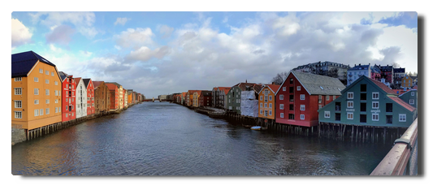

<!--
.. title: Love Boat - The Real Story. Trondheim
.. slug: norge08
.. date: 2019-03-25 15:32:32 UTC+01:00
.. tags: norwegen,norway,kreuzfahrt,cruise
.. category: unterwegs
.. link: 
.. description: 
.. type: text
-->

# Tag 11. Vakker byen

We've been at sea for on and a half days and the ship is getting smaller. During times of strong sea disturbances the free moving space is very limited because the outer decks are shut for the most part (deck 6 and 11 completely, deck 10 only has a few meters at the doors to catch some fresh air). In the early morning I get on the crosstrainer in the gym on deck 9 and after the shower go for a little walk outside.

Like this:
- leave the cabin, go one floor upstairs, greet the vacuum crew
- get out at deck 6 and walk one or two complete rounds, greet the outer decks maintenance crew (I wonder if they think I'm crazy)
- take the stairs at the stern, pass the Ocean Bar, then upstairs on the other side, past deck 9
- deck 10, greet the smokers on their morning coffee and cigarette routine, around the pool deck, greet the clean up crew
- take the stairs to deck 11, walk at least two rounds
- return

Like a prisoner on a daily walk in the prison yard.

In the evening we finally make fast in Trondheim and will stay there until early afternoon. The stormy ocean has made every single person land-hungry and so swarms of passengers and several crew members invade the empty city after dinner.

|  |
| --- |
| *Nidarosdomen* |

## Where are we really here?

We head into the city center area, passed the illuminated Nidarosdomen, across bridges and back and forth. The city exudes an odd familarity to us. While settlements and landscape differed very much from home until now, the city style of Trondheim reminds us widely of the city of Potsdam. It is so weird that we stop several times to discuss what place this just reminds us off. Obviously the sea made us go mad.

Apart from that both cities have no direct connection but there are some parallels that support the mirage and the convergence in urban development:
    * both cities are of the same age
    * they are similar in population size
    * they are surrounded by much waters
    * they have public transportation via tram
    * they are regarded cultural cities
    * Trondheim used to be national capital for a long time, Potsdam was official capital of the kingdom of Prussia

|  |
| --- |
|  |
| *Trondheims nette Ecken* |

## Fading out the day

After our return to the ship we make plans for the next day and meet later in the AIDA Bar. The ship's band plays classic songs with crew members and we have beer. I've already forgot about the Trollfjord.

|  |
| --- |
|  |
| *Tagesplaner im Bordportal und tägliche Info in Papierform* |

