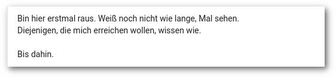

<!--
.. title: The Notwork
.. slug: diegplusdie
.. date: 2018-10-14 15:30:59 UTC+02:00
.. tags: google+
.. category: socialmedia
.. link: 
.. description: 
.. type: text
-->

**Die Nachricht ereilte mich per Twitter: das Ende von Google+ ist besiegelt. Na und? - Das Netzwerk hat doch schon lange seinen Reiz verloren.**

## Richtiges Netzwerk, falsche Zeit

Als Google im Jahr 2011 sein eigenes soziales Netzwerk launchte, sollte es der Facebook-Killer werden, ohne wie Facebook auszusehen oder zu funktionieren. Dies wirkt zunächst einseitig fokussiert, muss man jedoch bedenken, dass Facebook das mit großem Abstand führende soziale Netzwerk zu dieser Zeit war.

Im deutschsprachigen Raum findet man unter den [Top 20 der sozialen Netzwerke](https://www.muenchnermedien.de/die-20-beliebtesten-sozialen-netzwerke-deutschlands-2011) neben dem Primus noch die VZ-Netzwerke, Jappy, WerKenntWen und Stayfriends - Netzwerke, die inzwischen heute ein Nischendasein fristen, falls sie noch existieren.

Angesichts der Konkurrenz konnte die Prognose doch gar nicht so schlecht sein? - Wenn da der blaue Riese nicht gewesen wäre. Google erwischte den vielleicht schlechtesten Zeitpunkt zum Launch. Facebook hatte weitgehende Marktbeherrschung und -sättigung (beim Nutzer) errungen. Die Mehrheit war einfach nicht gewillt, aktiv ein weiteres Netzwerk zu nutzen, weil sie schlicht keinen Grund darin sah. Die anhaltende massive Kritik und der Verdruss kamen später.

## Die Spielwiese

Wie viele andere habe auch ich schnell Gefallen an Google+ gefunden. Das Kreis-Konzept ermöglichte es, den aktiven wie passiven Gebrauch gruppenbezogen zu filtern. Es gab einen uneingeschränkten Gesamtstream und mit der Ripples-Funktion konnte man den Weg von Beiträgen verfolgen.

Alle drei Elemente hat Google im Laufe der Zeit abgeschafft oder dies zumindest versucht (Kreise wurden nach Protest doch beibehalten, sie waren aber in der mobilen App später standardmäßig nicht aktiviert, allerdings wurde die Kreise teilen-Funktion abgeschafft).

Ideen wie Bildbearbeitungs-Events, echte Gespräche in Kommentarspalten, der Austausch mit vielen unbekannten Leuten und glorreicher Quatsch aller Niveaustufen zeichneten Google+ aus.

|  |
| --- |
| *GIMPen, bis der Arzt kommt. Mein Beitrag zum [Hack My Church - Photomanipulation Contest](https://plus.google.com/events/cps909u1f2odcspo2b9davpq6ng)* |

## Falsch abgebogen

Es war lange Zeit die Rede davon, dass Google+ absolute Priorität im Unternehmen hat. Doch was war nach dem Launch neben der Einführung von Communities und den minimalen Markup-Möglichkeiten eigentlich die letzte positive Entwicklung an Google+? Na? Stimmt, Collections und das Umfragetool waren passende Ergänzungen. Aber sonst?

| {} |
| --- |
| *Post von vor 5 Jahren: Google hat mal wieder an Plus herumgedoktort* |

Die Mängelliste ist mit der Zeit stetig gewachsen und als Sahnehäubchen gab es noch den Zwangsaccountverknüpfungs-PR-GAU obendrauf. Mal überlegen, was mir so einfällt:

* umständliches Kreismanagement, das nie irgendeine Pflege erhielt
* Fotos:
    * Einschränkung der Bearbeitungsfunktion
    * Alben und Stories (letztere später nicht mehr), Kommentare sprengen einzelne Fotos als Beiträge ab
* das YouTube/Google+-Kommentarsystem und generell halbseidene Integration
* Versuch einer Reallnamendurchsetzung
* "+1"-Empfehlungen
* Abschaffung von Ripples
* Abschaffung der Geburtstagsnotiz
* Unvollständiger "Alles"-Stream
* Ausklappen der Kommentare in "Facebook-Verhalten", also Anzeige der letzten, nicht aller, Kommentare
* Buttons sind mal eckig, dann rund und was links ist, wandert nach rechts
* Speicherhunger der (Android-)App
* defizitäre Benachrichtigungsfunktion
* Abschaffung von Community-Managern oder irgendwelchen Ansprechpartnern
* die [merkwürdige Beitragsauswahl](https://plus.google.com/105146352752269764996/posts/ghoot8ryt5C) des "Angesagten"/"What's hot"-Streams
* kaputte Streams, plötzlich auftauchende uralte Beiträge
* Spaces
* der Mord an Mr. Jingles

Jedes Mal, wenn ein Update für Google+ angekündigt wurde, ging die allgemeine Stimmung in den Keller, man verabschiedete sich im Voraus und selbst die überzeugtesten Atheisten beteten *"bitte lass es nicht so schlimm sein"*.

Diagnose: Stockholm-Syndrom.

## Klimawandel

Der Schuldige an der Misere ist gefunden. Google hat es versemmelt. Aber das ist nicht die ganze Wahrheit. Kommen wir zum Elefanten im Raum: der nachlassenden Qualität und thematischen Varianz der Inhalte gefolgt von der Abwanderung der Nutzer gefolgt von nachlassender Interaktion. Teufelskreis.

Was Google+ einmal auszeichnete, war die gute thematische Durchmischung. Es gab einige größere Nachrichtenportale, die eine Präsenz pflegten und in deren Beiträgen man sich austauschen konnte (einfach so, mit fremden Leuten), es gab die Fotografen mit Hashtagterror, Kitschbilder, Musik, Katzen, Fahrräder, Autos, Blümchen, viel schrägen Humor und noch mehr Technik.

Dann fielen zuerst die Nachrichtenseiten aus. Im Allgemeinen gingen diese dazu über, sofern sie es nicht schon von vornherein taten, Google+ als Linkablage mit geschlossenen Kommentaren zu nutzen (manchmal wurde man aufgerufen, etwas zu liken).

Andere, wie etwa der Deutschlandfunk, stellten ihre Aktivität ganz ein und konzentrierten sich auf andere Verbreitungskanäle wie etwa das für eine Hörfunkanstalt sehr viel näher liegende Instagram.

{}

Inhaltlich kippte es von sachlichen, längeren Beiträgen hin zu leicht verdaulicher Screenshot-Kost vorwiegend zu Twitter, etwas Facebook, Klickstrecken, zu komplizierten Sachverhalten wurde allmählich nur noch ein Ja oder Nein geduldet, eine kurzlebige Empörungswelle folgte der nächsten und darüber wurde nie das regelmäßige Virtue Signalling vergessen.

{}

Dafür benötige ich allerdings kein weiteres soziales Netzwerk, das einst durch sein etwas gehobenes Niveau auffiel, denn dann verwende ich nämlich das Original.

|  |
| --- |
| *Eine Abschiedsnachricht* |

Bei mir besteht nicht primär die Frage, welche alternativen Plattformen für Google+-Nutzer jetzt in Frage kommen, sondern wohin die bereits abgewanderten ehemaligen Nutzer hin sind und ob diese überhaupt wieder aktivierbar wären.

Denn das Google+, das zum jetzigen Zeitpunkt übrig geblieben ist, möchte ich nicht mehr, auch nicht woanders.

## Read on, my dear

* [engadget: Goodbye Google+, you beautiful, squandered opportunity](https://www.engadget.com/2018/10/12/goodbye-google-plus-you-beautiful-squandered-opportunity/)
* [GoogleWatchBlog: Einstellung von Google+: Wieder einmal wurde eine Plattform mit großem Potenzial an die Wand gefahren](https://www.googlewatchblog.de/2018/10/einstellung-googleplus-wieder-plattform/)
* [Takeout-Daten nach Nikola importieren](https://encarsia.github.io/posts/import-gplus-nikola)

<a class="discuss-on-gplus" href="https://plus.google.com/105146352752269764996/posts/L7QmEaD7HYx">Kommentieren auf <i class="fa fa-google-plus"></i></a>

