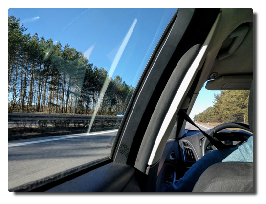
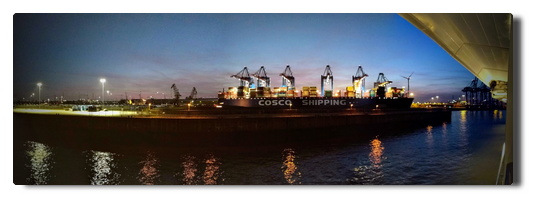

<!--
.. title: Love Boat - The Real Story. Hamburg
.. slug: norge01
.. date: 2019-03-10 20:32:32 UTC+01:00
.. tags: norwegen,kreuzfahrt,hamburg
.. category: unterwegs
.. link: 
.. description: 
.. type: text
.. status: private
-->

# Tag 1. Hamburg

## Habemus Gepäck

Wir sind vier Erwachsene und ein Dreijähriger auf zweiwöchiger Winterreise. Zur Überraschung der meisten Beteiligten wird das gesamte Gepäck innerhalb einer Minute geräuschlos im Kofferraum verstaut. Gutgelaunt oder zumindest in entspannter Nichtlaune fahren wir Richtung Hamburg. Ein paar Stunden später erreichen wir den Parkplatz des Shuttleservice, geben unser Gepäck auf, checken ein und schon stehen wir auf dem Kahn.

Das Schiff gleicht einem Ameisenhaufen, im Inneren wimmeln Passagiere auf der Suche nach Kabinen und Orientierung und Crew, die die ankommenden Koffermassen verteilt und anderen Arbeiten nachgeht. Nach einem ersten Vortasten in fremden Gefilden, unsere kleine Reisegruppe ist AIDA-unerfahren, beschließen wir, vor dem Ablegen einen Kaffee zu trinken.

|  |
| --- |
| *Anfahrt* |

## Das Getränke-Abrechnungssystem

Wir hatten die Flatrate für alkoholfreie Getränke gebucht und zusätzlich zur Bordkarte eine entsprechende Karte beim Check-In erhalten. Diese sollte uns nun die Heißgetränke auf den Tisch zaubern.

Nach Lieferung der Getränke erhielten wir zu unserer Verblüffung, denn wir hatten ja die Flatrate, einen zu unterzeichnenden Beleg. Der damit konfrontierte Servicemitarbeiter war zunächst wenig hilfreich, da seine Englischkenntnisse ungefähr dem meiner Mitreisenden entsprach. Na das konnte ja noch lustig werden...

Ich konnte dem leicht überforderten und vielleicht auch ein wenig eingeschüchterten sehr jungen Mitarbeiter doch noch die relevante Information entlocken. Die Getränke werden je nach Buchungsart entweder dem Bordkonto angerechnet oder auf eine vorhandene Flatrate gebucht - in jedem Fall werden die Artikel im System unter dem Normalpreis erfasst. Die Bestellung muss dann mit Kabinennummer und Unterschrift quittiert werden. Die Bons werden gesammelt, eingelesen und stehen dann auch zur Einsicht bereit (auch um Missbrauch und Fehlbuchungen zu erkennen/aufzuspüren).
Sagt einem nur keiner.

!!! tip "AIDA-Feedback"
    Auch wenn die Bordsprache mit "Deutsch" angegeben ist und ein Teil des Servicepersonals aus Muttersprachlern besteht (Rezeption, Ausflugscounter, Guides/Scouts, Restaurantleiter), kommt man aufgrund der internationalen Belegschaft mit Englisch doch am ehesten zum Ziel.
    Angesichts der Zielgruppe der Reisenden sollte dies ehrlicherweise gezielt kommuniziert werden.

## Leinen los

Pünktlich um 18 Uhr stehen wir aufgeregt und glücklich auf Deck 6 und beobachten, wie sich das Schiff langsam von der Pier und dann vom Hamburger Hafen entfernt. Es stehen noch ein Abendessen und die Begrüßungsveranstaltung im Theater an.

Irgendwann gegen 22 Uhr, wir sind auf dem Weg Richtung Dänemark, ist Nachtruhe auf dem Schiff eingekehrt. Mein Tag, die ganze Woche, war lang, stressig und ereignisreich und ich beschließe, auf dem Hamsterrad im Sportstudio auf Deck 9 noch etwas herunterzukommen.
Ich schlafe bestens.

|  |
| --- |
| *Auslaufen aus dem abendlichen Hamburger Hafen* |

