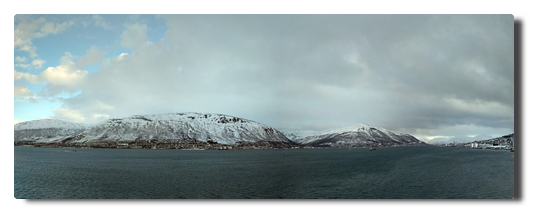

<!--
.. title: Love Boat - The Real Story. Tromsø
.. slug: norge07
.. date: 2019-03-25 13:32:32 UTC+01:00
.. tags: norwegen,norway,kreuzfahrt,cruise
.. category: unterwegs
.. link: 
.. description: 
.. type: text
-->

# Tag 8. Tromsø rain, Tromsø rain

Mittags erreichen wir den Hafen der größten nordnorwegischen Stadt Tromsø, wo wir einen ganzen Tag Aufenthalt genießen. Vom Liegeplatz bis in die Innenstadt ist ein Busshuttle eingerichtet.

|  |
| --- |
| *Empfang!* |

Ich laufe durch die Stadt, überquere natürlich die Tromsøbrua (Tromsøbrücke) bis zur Ishavskatedralen (Eismeerkathedrale).

Es regnet bei Temperaturen deutlich über dem Gefrierpunkt und der komprimierte Schnee hat sich durch wiederholtes Antauen und Gefrieren in dicke Eisplatten verwandelt, die nun abtauen. Man läuft also auf wasserbedecktem Eis, das von tiefen Pfützen umrahmt wird, die von schnell fließendem Schmelzwasser genährt werden. Am Abend sind meine Schuhe durch.

Die vertagte Polarkreistaufe wird nun heute nachgeholt, wegen des Regens allerdings nicht auf dem Pooldeck, sondern in der AIDA Bar. Manche dieser Aktionen lassen erahnen, wie ballermanesk es beim schwimmenden Cluburlaub sonst üblicherweise zugeht. Ich verziehe mich alsbald.

Ein Teil unserer Reisegruppe geht später noch ins Konzert in die Eismeerkathedrale und ich früh zu Bett.

|  |
| --- |
|  |
|  |
| *Alles ganz schön hier und andere Reedereien haben auch schöne Schiffe (Ja, das ist **die** "Viking Sky").* |

# Tag 9. Sortland calling

Es regnet. Wir liegen immer noch in Tromsø und ich bin mal wieder in der Stadt unterwegs. Ich kaufe Postkarten, die ich beim nächsten Landgang einwerfen möchte.
Es regnet.

Wir legen ab mit Ziel Sortland. Ich verbringe den Nachmittag mit Kaffee, Kreuzworträtsel und Kartenschreiben. Bester Urlaub aller Zeiten.

# Tag 10. A storm is coming

Der Wecker klingelt in aller Früh', denn mein Landausflug zum Trollfjord geht um 8:00 Uhr los. Ich sitze mit anderen Ausflüglern am Frühstückstisch und wir verabreden uns für später. Nun, kurz vor 9 Uhr wird klar: es wird keinen Trollfjord geben. Es wird kein Sortland geben.

Wegen des Seegangs und des Windes können wir nicht in Sortland anlegen und erfahren im Laufe des Vormittags, dass wir einen vorgezogenen Seetag einlegen und direkt nach Trondheim durchfahren. Das Schiff rollt sich gemächlich durch den Atlantik und fordert zahlreiche Opfer, die in ihren Kabinen ausharren, bis es besser wird. Freie Platzwahl in den Bars.

In mir verbreitet sich eine leicht sentimentale Stimmung. Mehr als die Hälfte der Reise liegt hinter uns, wir fahren südwärts, es liegen nur noch zwei Stopps vor uns, bevor es in einer weiteren Tagesreise zurück nach Hamburg geht.

Mein Gehirn kann den Gedanken noch nicht ganz verarbeiten, dass in wenigen Tagen, nachdem man für zwei Wochen auf diesem Schiff mit hunderten von Menschen zusammengepfercht war und jeden Tag dieselben Leute gegrüßt und mit einigen einen kurzen Schwatz auf dem Flur gehalten hat (Hello Katrina!) die Wahrscheinlichkeit gegen Null geht, irgendjemanden von ihnen jemals wieder zu sehen. Die Gäste fahren nach Hause und machen da weiter, wo sie vor Hamburg aufgehört haben und die Crew sieht für zwei Wochen die nächsten Gesichter und macht da weiter, wo sie vor Hamburg aufgehört hat, nämlich sich ohne Unterlass den Arsch abzurackern (Kudos to all of you).

In diesem Zusammenhang erscheint es bizarr, Verkumpelungsversuche bei Gästen zu sehen. Wie funktioniert das? Machen die so häufig Kreuzfahrten, dass die immer wieder den gleichen Crew-Leuten über den Weg laufen? Ich kenne solche freundschaftlichen Annäherungsversuche aus meiner eigenen Tätigkeit im Kundenservice. Es liegt in der Natur der Sache, mit einigen Menschen näher auf einer Sympathieebene zu sein als mit anderen. Und bei diesen ist man auch zu einem gewissen Grad bereit, auf einer persönlicheren Ebene zu kommunizieren, ohne dabei die Grenze der Professionalität zu überschreiten.

Auf einem Kreuzfahrtschiff ist die Situation völlig zugespitzt. Als Gast mache ich vielleicht die Reise meines Lebens, bei der jeder Tag aufregend ist. Für die anderen Gäste bist du der nervende Nachbar mit dem komischen Dialekt oder der nette Zufallsgesprächspartner beim morgendlichen Rundgang an Deck. Für die Crew bist du diejenige, die für zwei Wochen ihre Klamotten auf dem Sofa in der Kabine verteilt, in den nächtlichen Morgenstunden durch das Schiff schlendert und an der Bar Ipanema ohne Zucker und noch mehr Espresso trinkt. Bis die nächsten kommen.

